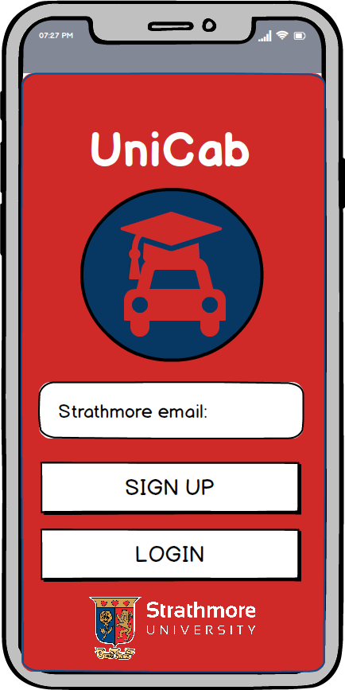
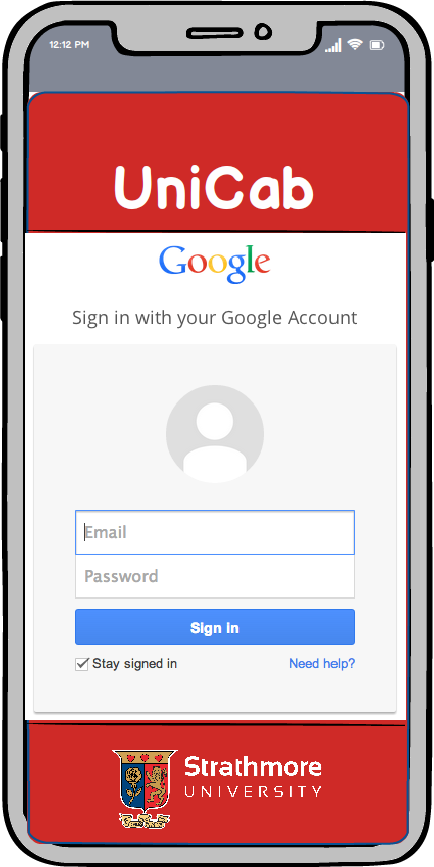
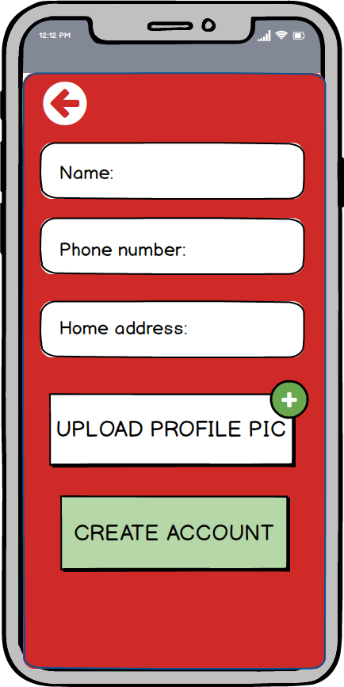
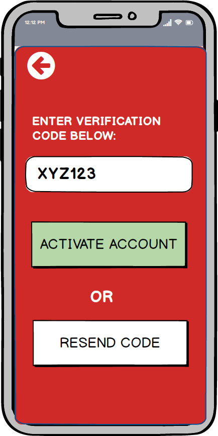
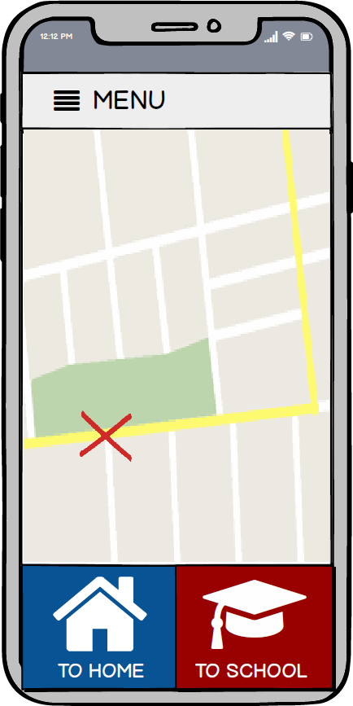
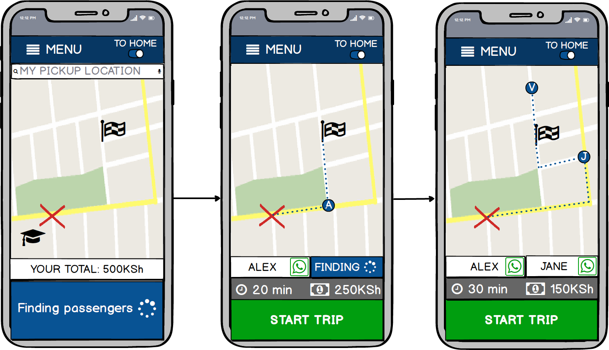
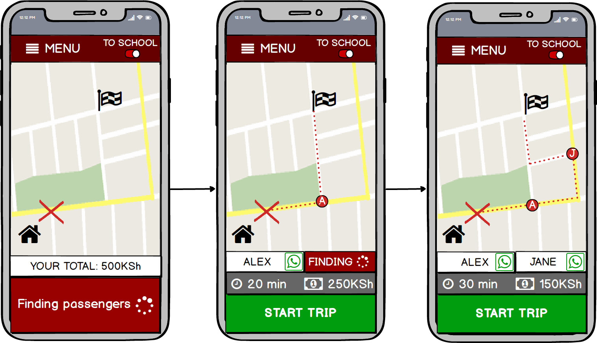
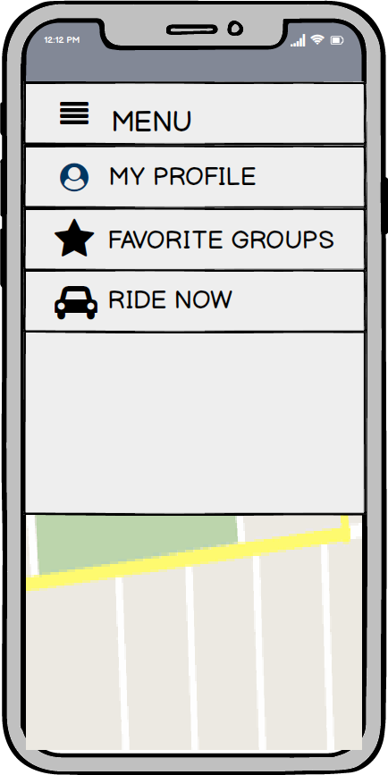
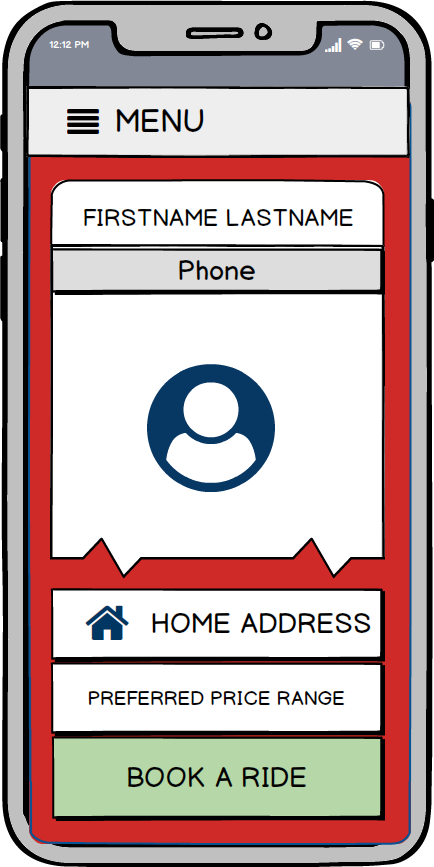

# unicab_restapi
RESTful API for the UniCab application, as part of the project course at Strathmore University. The API was used with the <a href="https://github.com/unicabAccount/UnicabAndroid">UniCab Android application</a>, also developed within the frame of the project course; providing the app with four main functionalities:
  - Checking if user exists in database
  - Adding a new user
  - Finding the two closest passengers for ridesharing
  - Managing existing users and trips

## API endpoints
### Login and signup:
  - GET: http://{ip-address}/api/userInDatabase/?email={theEmailOfUser}
    - Will return error message if user not in DB, which will prompt the user to signup w. Google Account
    - Otherwise a JSON object with the user information will be returned
  - POST: http://{ip-address}/api/userInDatabase/
    - Add new user to DB (signup), the body of the POST request have to provide a unique email address and the following attributes:
        "id", "first_name", "last_name", "email", "date_of_birth", "phone_nr", "faculty", "home_latitude", "home_longitude", "profile_picture", "description"
    - Additional attributes of the database that are set by default are:
      
      Attribute         | Default
      ------------------|---------
      nr_of_trips_done  | 0
      avg_rating        | NULL
      is_searching      | FALSE
      phone_verified    | FALSE

### Searching for nearby users:
  - GET: http://{ip-address}/distanceview/{theUserEmail}/
    - Will return the top two passengers for ridesharing based on a simplified <i>Euclidian distance</i> measure
    - The query for choosing the passengers is based on the is_searching flag being TRUE
    - The query orders ASC by distance and the the two top candidates are selected
    - Thus, the calculation is simplified and leave room for future improvements by:
      - Considering the actual path to/from school as well as distance from user.
      - Implement threshold for choosing a second additional passenger based on actual time or cost reduced (sometimes it will simply not be cost effective to pick another person up)
    - The candidates will be returned as JSON objects with all relevant information
    
    

## Additional feature
### User management: 
  - Overviewing, adding, editing and removing users from the PostGreSQL database via a simple GUI.
    - Overview users: http://{ip-address}/admin/usermanager/users/
    - Add user: http://{ip-address}/admin/usermanager/users/add/
    - Edit user: http://{ip-address}/admin/usermanager/users/{theUserID}/change/
    - Remove user: http://{ip-address}/admin/usermanager/users/
      - Select user object to be removed from list.

## Balsamiq Prototype
### 1. Signup & login

  
  
  
  

### 2. Initiate ride

  

### 3. Find peers

#### 3.1 To home

#### 3.2 To school

### 4. Additional screens

 
  
  

